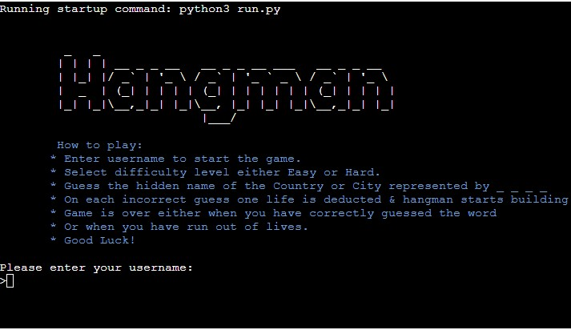
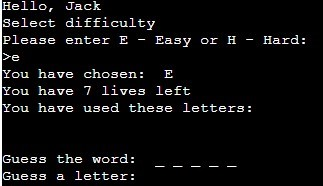
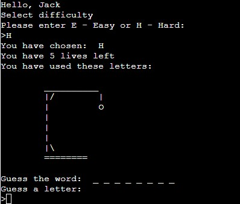
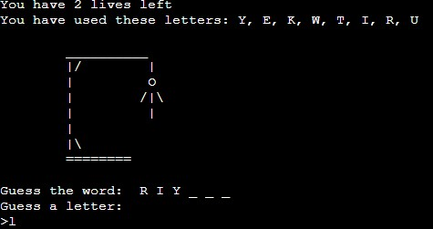
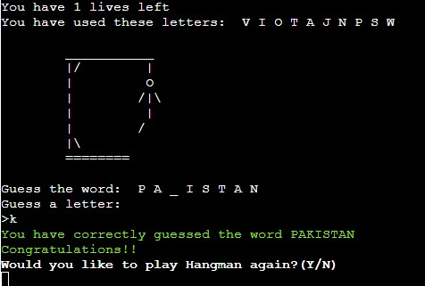
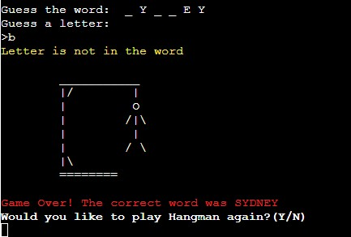

# Hangman-CoC (Country or City)

## Code Institute: Milestone Project 3

### Python Essentials: A command-line application

[Click here to view the live project.](https://hangman-coc.herokuapp.com/)

[Click here to view the repository.](https://github.com/PratimaGurav/hangman-coc)

## Table of Contents:
- [User Experience (UX)](https://github.com/PratimaGurav/hangman-coc#user-experience-ux)  

- [Features](https://github.com/PratimaGurav/hangman-coc#features)

- [Technologies Used](https://github.com/PratimaGurav/hangman-coc#technologies-used)
  
- [Testing](https://github.com/PratimaGurav/hangman-coc#testing)

- [Deployment](https://github.com/PratimaGurav/hangman-coc#deployment)

- [Credits](https://github.com/PratimaGurav/hangman-coc#credits)

- [Acknowledgements](https://github.com/PratimaGurav/hangman-coc#acknowledgements)
    

## User Experience (UX)

### Introduction
  Hangman-CoC is a Python based game, which runs in the Code Institue mock terminal on Heroku.
  It is a challenging word search game involving user interaction to guess a word which would be a name of a country or a city. Color scheme has been implemented to enhance user experience. The game starts with requesting user to enter a name. The game has two difficulty levels which are Easy and Hard that has to be selected by the user. Users have to guess the letters of the hidden word with limited number of lives which vary based on the difficulty level. Each wrong guess takes away one life building the hangman. The game is over either when the user has correctly guessed the word or there are no lives remaining. 
     
### How to Play
  Users can play Hangman_CoC using mock terminal. 
  -  User will be prompted to enter name to start the game. 
  -  User will be promoted to select difficulty level. 
  - Easy and Hard are the two difficulty levels. 
  - Easy has 7 lives to guess the word while Hard has 5 lives.
  -  Upon selecting the difficulty level, the game starts with an aim to guess the hidden word.
  - The hidden word is represented by _ _which display users the number of letters in the word. 
  - User now have to guess the letters that would make the word.
  - With each correct guess, the _ is replaced with the correct letter. 
  - With each incorrect guess, one life is deducted. This is visualize graphically using hangman. 
  - The game is over either when the user has correctly guessed the word or they have run out of lives. 
  - Users can either choose to restart or quit the game.

     
### Audience
  The application is aimed for enthusiasts who like to play guess the word game. People from all ages and different background can play this challenging and interactive game.

### User stories

  #### First Time Visitor
   1. I want to be able to start the game easily.
   2. I should easily understand the instructions of the game. 
   3. I want the game to run easily which would keep me engrossed.

  #### Returning Visitor
   1. I should find the game challenging with different difficulty levels.
   2. I should enjoy the game.   

    
### Design

  - [Code Logic Flowchart]
   
    
## Features

 ### Existing Features
  - Homescreen
    - Displaying title
    - Game instructions
    - Retrieve username

    

  - Select difficulty level. 
    - Easy : 07 lives
   
    

    - Hard : 05 lives    
   
    

  - Number of lives are represented with graphic.
    - On correct guess, the _ is replaced with the correct letter.

    
    
    - On incorrect guess, hangman builds up and the same is represented by using an image.

    

  - Game Over
    - Game ends either by guessing the word correctly or if user runs out of lives.
    - Users can opt to play the game again or quit  it.

    
      

  - Color Scheme: This has been implemented to enchance user expierence.
      - Blue for game instructions.
      - Yellow for warning messages.
      - Green for winning the game.
      - Red for game over when user runs out of lives.
      

### Future Enhancements 
  - Add provision to display hint to user on request.
  - Implement scoring system.
  - Implement a timer to guess each letter.

## Technologies Used

### Languages Used

  -   [Python](https://en.wikipedia.org/wiki/Python_(programming_language))
  -   [MARKDOWN](https://en.wikipedia.org/wiki/Markdown)

### Frameworks, Libraries & Programs Used

  - [Git](https://git-scm.com/) was used for version control by utilizing the Gitpod terminal to commit to Git and Push to GitHub.
  - [GitHub](https://github.com/) was used to store the projects code after being pushed from Git.   
  - [Lucidchart](https://www.lucidchart.com/) was used to create the flowchart during the inital phase.
  - [Heroku](https://heroku.com/) applicaiton was used to deploy the project.
  - [ASCII Art Generator](https://patorjk.com/software/taag/#p=display&f=Standard&t=Hangman) was used to generate text for the title.    
    
## Testing

### Bugs
  1. Game continues with blank username
  - Step to reproduce: 
    - Start the game.
    - Enter blank username and continue.
    - Game will procced to next level without any error message. 
  - [Error Screenshot](assets/images/bug-no-name.jpg)
  
  - Fix: 
    - This was fixed by creating a separate function for title message and input username.
    - Additionally if-else statement was added to check if blank username was entered.
  - [Fixed Screenshot](assets/images/fix-no-name.jpg)
    
  2. Game terminates after selecting difficulty level other than E or H
  - Step to reproduce: 
    - Start the game.
    - Enter username and continue.
    - Enter difficulty level other than E or H.
    - Game will terminate. 
  - [Error Screenshot](assets/images/bug-incorrect-difficulty-level.jpg)
  
  - Fix:
    - This was caused as function and variable had same name. 
    - This was fixed by modifying the variable name.
  - [Fixed Screenshot](assets/images/fix-incorrect-difficulty-level.jpg)      

  3. Hangman was not displayed after losing the last life
  - Step to reproduce: 
    - Start the game.
    - Enter username and continue.
    - Enter difficulty level either E or H.
    - Play the game and run out of lives.
    - Hangman was not displayed at the end.
  - [Error Screenshot](assets/images/bug-no-display-hangman.jpg)
  
  - Fix:
    - This was fixed by updating the correct variable for displaying hangman.
  - [Fixed Screenshot](assets/images/fix-display-hangman.jpg)   

### Validation
  [PEP8](http://pep8online.com/) was used to validate the code.
  
  Following errors were found and fixed while validation:
  - [Error](assets/documents/pep8-error-run.jpg)
  
  Fixed : Added new lines and shortened the print messages. 

### Further Testing

 - Friends and family members were asked to play the quiz and provide feedback.
    - How to play the game was added as few members were mot aware of playing hangman digitaly.
    - Color scheme was added at later stage to provide better user expierence.

  - ### Known Bugs

    - There are currently no known bugs   

## Deployment

 - ### GitHub Pages

  The project was deployed via [Heroku](https://heroku.com/) using the following steps...

  - Creating Application on Heroku:
    - Ensure all codes are correct and ready for deployment.
    - Log in to Heroku with your credentials.
    - Navigate to the Dashboard.
    - Click "New" and from the drop down menu select "create app". This is located on the upper right side of the window.
    - Provide a name for your application which has to be unique and select your region.
    - Click "Create App".

  - Setting up the Application:
    - Navigate to "Settings". Scroll to "Config Vars" and select "Reveal Config Vars". Input the following. KEY: PORT, VALUE:8000. The project does not have any confidentail data hence no additional steps needed.
    - Then scroll and select "Buildpacks" and then click both "python" and "node.js"(node.js is needed for the mock terminal).
    - Ensure that the python buildpack is above the node.js buildpack, You can click and drag the packs to re-arrange them.
    
  - Application Deployment:
    - Navigate to the "Deploy" section.
    - Scroll down to "Deployment Method" and select "GitHub".
    - Authorize the connection of Heroku and GitHub.
    - Search for your GitHub repository name, and select the correct repository.
    - For Deployment there are two options, Automatic Deployments or Manual.
      - Automatic Deployment: This will prompt Heroku to re-build your app each time you push your code to GitHub.
      - Manual Deployment: This will only prompt Heroku to build your app when you manually opt to do so.
    - Ensure the correct branch is selected "master/Main", and select the deployment method that you desire. In this case, I will be using Automatic Deployment.
 

 - ### Making a Local Clone

    1. Log in to GitHub and navigate to the [GitHub Repository](https://github.com/PratimaGurav/hangman-coc)
    2. To clone the repository using HTTPS, click Code and copy the address. 
    
    3. Navigate to Git Bash and clone the repository. 
    
    4. Press Enter and your local clone will be created. 
    

## Credits

  - ### Code
    - Love-Sandwiches walk through project was referred throughout the project for better understanding.
    - Stack Overflow was referred to add [colored text](https://stackoverflow.com/questions/287871/how-to-print-colored-text-to-the-terminal) to be printed to the terminal.
    

## Acknowledgements

  -   My Mentor for continuous helpful feedback and advises.
  -   All the tutors (Scott, Ed and Igor) for helping me understand and fix few bugs.
  -   Slack community and my fellow slackers for being available at any given time of the day.

## [BACK TO TOP](https://github.com/PratimaGurav/hangman-coc#hangman-coc-country-or-city)